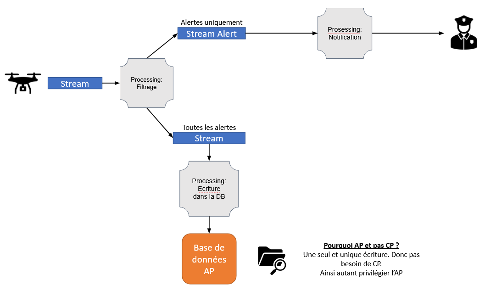

# Peaceland
Projet EPITA de la matière Spark en SCIA.

## Questions

> Quelles sont les contraintes techniques/business auxquelles le composant de stockage de données de l'architecture du programme doit répondre pour satisfaire l'exigence décrite par le client dans le paragraphe "Statistiques" ? Ainsi, de quel(s) type(s) de composant(s) (listés dans le cours) l'architecture aura-t-elle besoin ?

Contraintes business
- Conserver tous les rapports
- Pouvoir en établir des statistiques : les données doivent être disponibles

Contraintes techniques
- Un flux de données pouvant gérer 200Go par jour
- Pouvoir stocker des quantités énormes de données pour une durée indéterminée (73To par an)

Composants
- Base de données noSQL
- Flux de données

> Quelle contrainte métier l'architecture doit-elle satisfaire pour répondre à l'exigence décrite dans le paragraphe "Alerte" ? Quel composant choisir ?

- Le délai de réaction doit être court pour que le pacifieur puisse régler le probleme le plus rapidement possible.

Composants 
- Une queue / stream / flux

> Quelle(s) erreur(s) de Peaceland peut expliquer la tentative ratée ?

- Utilisation d'une mauvaise architecture
- Ils ont engagé une équipe spécialisée dans les données (data scientist) et une équipe spécialisée dans l'informatique. Erreur : Ne pas avoir pris d'architecte (data engineer) aurait fait office de "chef d'orchestre" du projet
- Et surtout, ils ne nous ont pas choisi dès le début

##### Annexes
Différents composants existant:
- Queue de données avec au moins une queue distribué
    (une qui va etre consommée par l'analyseur d'alerte et une par la database de stockage)
- Database de stockage

---
Point importants:
- La nuit il y a surement moins de données. Les pacifieurs dorment. (role de la partie Statistique ?)
- Quelle est la taille d'un seul évenement / Combien il y d'event par jour
- Les 1% peuvent bcp variés (manifestations ou autre)

## Architecture

Suite à ces réflexions, voici l'architecture que nous proposons

## Authors
- Guillaume LARUE
- Youenn LOIE
- Nicolas TRABET

## License
For open source projects, say how it is licensed.

